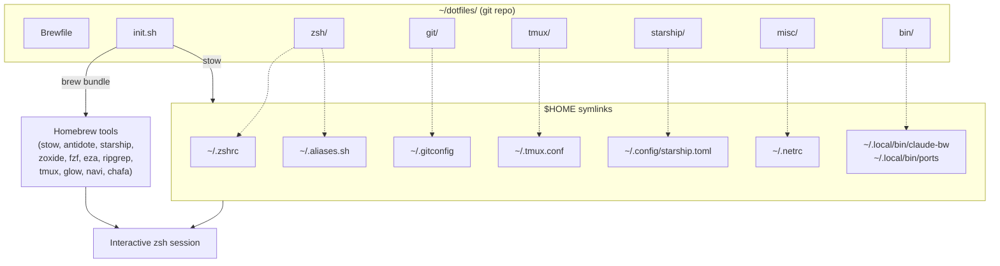

# Dotfiles

Personal dotfiles for macOS. One git repo, symlinked into `$HOME` by [GNU Stow](https://www.gnu.org/software/stow/). Shell, git, tmux, and tooling all wake up pre-configured on a fresh machine.

## Fresh machine setup

Install [Homebrew](https://brew.sh) first, then:

```bash
git clone git@github.com:meninoebom/dotfiles.git ~/dotfiles
cd ~/dotfiles
./init.sh
exec zsh
```

`init.sh` is idempotent — safe to re-run any time. It installs everything in `Brewfile`, backs up colliding files, and stows every package.

## Architecture



**How to read it.** `init.sh` does two things. (1) `brew bundle` installs every required binary from the `Brewfile`. (2) `stow` creates symlinks from `$HOME` that point back into the repo. When zsh starts, it reads `~/.zshrc` — which is a symlink back to `~/dotfiles/zsh/.zshrc`. Edit in either place, same result.

## The stack

| Layer | Tool | Role |
|---|---|---|
| Shell | **zsh** | macOS default shell |
| Plugins | **[antidote](https://getantidote.github.io/)** | Fast zsh plugin manager (replaces oh-my-zsh) |
| Prompt | **[starship](https://starship.rs/)** | Themeable prompt with git/python/venv awareness |
| Navigation | **[zoxide](https://github.com/ajeetdsouza/zoxide)** | `z <fragment>` jumps to frequent dirs |
| Search | **[fzf](https://github.com/junegunn/fzf)** | `Ctrl+R` history, `Ctrl+T` file picker, `Alt+C` cd picker |
| Listing | **[eza](https://eza.rocks/)** | `ls` replacement (aliased as `ls`, `lv`, `lt`, etc.) |
| Recursive search | **[ripgrep](https://github.com/BurntSushi/ripgrep)** | `rg <pattern>` — fast grep, respects `.gitignore` |
| Markdown viewer | **[glow](https://github.com/charmbracelet/glow)** | Render markdown beautifully — `glow <file>` |
| Cheatsheet picker | **[navi](https://github.com/denisidoro/navi)** | Fuzzy-finder over your own command cheatsheets |
| Multiplexer | **tmux** | Terminal multiplexer, prefix `Ctrl+A` |
| Editor | **vim** | Homebrew vim for quick edits |
| Dotfiles | **[stow](https://www.gnu.org/software/stow/)** | Symlink farm from repo → `$HOME` |

## Layout

```
~/dotfiles/
├── Brewfile              # Required tools (brew bundle source of truth)
├── init.sh               # Idempotent setup script
├── README.md             # This file
├── zsh/                  # Shell config
│   ├── .zshrc            # Main rc file (vi mode, plugin loader, tool init)
│   ├── .zsh_plugins.txt  # Antidote plugin list
│   └── .aliases.sh       # Command + project-jump aliases
├── git/
│   ├── .gitconfig        # User, editor, aliases, colors
│   └── .gitignore_global
├── tmux/
│   └── .tmux.conf
├── starship/
│   └── .config/starship.toml
├── misc/
│   └── .netrc
└── bin/
    └── .local/bin/        # Custom CLIs symlinked into ~/.local/bin
        ├── claude-bw      # Launch Claude Code with a live Bitwarden session
        └── ports          # Port management for macOS (list/pick/kill/sweep)
```

## What this repo deliberately does NOT track

These live outside the dotfiles by design. If you set up a new machine, here's what you'll need to handle separately and why:

| Asset | Where it lives | Why not tracked | Recovery |
|---|---|---|---|
| `~/zk/` (personal Zettelkasten vault) | Its own git repo | Separate concern — your notes, not your shell config | `git clone <your-zk-remote> ~/zk` then `python3 -m venv ~/zk/.venv && ~/zk/.venv/bin/pip install click pyyaml`, then `ln -s ~/zk/bin/zk ~/.local/bin/zk` |
| `~/.local/share/navi/cheats/*.cheat` | Loose files in `~/.local/share/` | Cheatsheets are recipes — easy to regenerate from the tools they describe | Copy the directory by `scp` from your old machine, or regenerate by reading each tool's `--help` |
| `~/zk/.venv/` (Python venv for `zk`) | Inside the zk repo (gitignored) | Venvs are machine-specific binaries | Recreate per the zk recovery row above |

The principle: track what's **expensive to recreate**, skip what's **easy to rebuild from a recipe**.

## Daily use

### Keybindings

Vi mode is on (`bindkey -v` in `.zshrc`). Insert mode is the default and looks like a normal shell — press `Esc` for normal mode (`hjkl`, `dw`, `cc`, etc.). `Ctrl+R` (fzf history search) works from either mode.

### Navigation

| Command | Does |
|---|---|
| `z <fragment>` | Jump to any directory you've visited before |
| `zi` | Interactive fzf picker over zoxide's learned dirs |
| `cd -` | Previous directory |
| Project aliases (`ralf`, `breadcrumbs`, `tend`, `alleeoop`, etc.) | Instant `cd` — work from day 1 on a fresh machine |

### Listing (eza)

| Alias | Expands to |
|---|---|
| `ls` | `eza` |
| `lv` | `eza -1` |
| `lva` | `eza -1 --all` |
| `lt` | `eza --tree` |
| `lta` | `eza --tree --all` |

### Edit config fast

| Alias | Opens |
|---|---|
| `zshrc` | `~/.zshrc` |
| `aliases` | `~/.aliases.sh` |
| `hosts` | `/etc/hosts` (sudo) |

### View the architecture diagram inline

```bash
cd ~/dotfiles && diagram
```

`diagram` extracts the first mermaid block from a markdown file (defaults to
`./README.md`), renders it via [mermaid.ink](https://mermaid.ink), and displays
the result in your terminal using `chafa` (or `imgcat` if available). Works in
Warp, iTerm2, Kitty, and any sixel-capable terminal.

## Modifying the setup

### Add a tool

```bash
echo 'brew "htop"' >> Brewfile
brew bundle --file=Brewfile
```

### Add a file to an existing package

Drop it in the package directory mirroring its `$HOME` destination, then restow:

```bash
vim ~/dotfiles/zsh/.functions.sh
cd ~/dotfiles && stow -R -t ~ zsh
```

### Add a whole new package

```bash
mkdir -p ~/dotfiles/newpkg/.config/foo
# Put files at the path they should end up at (relative to $HOME)
cd ~/dotfiles && stow -t ~ newpkg
```

Then add `newpkg` to the `PACKAGES` array in `init.sh` so it gets stowed on fresh installs.

## Stow cheatsheet

```bash
cd ~/dotfiles
stow -t ~ <pkg>      # apply (create symlinks)
stow -D -t ~ <pkg>   # remove (delete symlinks)
stow -R -t ~ <pkg>   # restow (idempotent; fixes drift)
```

## Troubleshooting

**`stow` says "conflict" on a file.** That file already exists in `$HOME` as a real file, not a symlink. Move it out of the way and retry.

**Antidote plugins not loading.** Delete the cached bundle and let zsh regenerate it:
```bash
rm ~/.zsh_plugins.zsh && exec zsh
```

**Vi mode feels wrong.** Flip line 9 of `zsh/.zshrc` from `bindkey -v` (vi) to `bindkey -e` (emacs, the zsh default).

**Nuke everything and start over.**
```bash
cd ~/dotfiles && stow -D -t ~ zsh git tmux starship misc
```
All config lives in the repo, so nothing is lost — just re-run `./init.sh` when ready.
