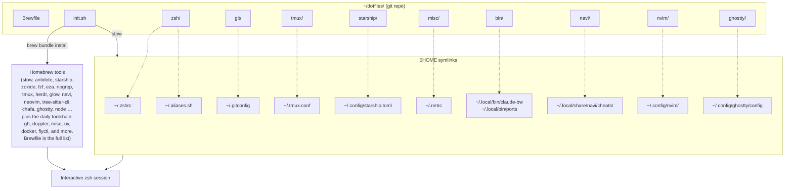

# Dotfiles

Personal dotfiles for macOS. One git repo, symlinked into `$HOME` by [GNU Stow](https://www.gnu.org/software/stow/). Shell, git, tmux, and tooling all wake up pre-configured on a fresh machine.

## Fresh machine setup

Install [Homebrew](https://brew.sh) first, then:

```bash
git clone git@github.com:meninoebom/dotfiles.git ~/dotfiles
cd ~/dotfiles
./init.sh
exec zsh
```

`init.sh` is idempotent — safe to re-run any time. It installs everything in `Brewfile`, backs up colliding files, and stows every package.

## Architecture


```mermaid
flowchart TD
    subgraph src["~/dotfiles/ (git repo)"]
        BF[Brewfile]
        IS[init.sh]
        Z[zsh/]
        G[git/]
        TM[tmux/]
        ST[starship/]
        MS[misc/]
        BN[bin/]
        NV[navi/]
        NE[nvim/]
        GH[ghostty/]
    end

    IS -->|brew bundle install| TOOLS["Homebrew tools<br/>(stow, antidote, starship,<br/>zoxide, fzf, eza, ripgrep,<br/>tmux, herdr, glow, navi,<br/>neovim, tree-sitter-cli,<br/>chafa, ghostty, node …<br/>plus the daily toolchain:<br/>gh, doppler, mise, uv,<br/>docker, flyctl, and more.<br/>Brewfile is the full list)"]
    IS -->|stow| LINKS

    subgraph LINKS["$HOME symlinks"]
        direction TB
        HZ["~/.zshrc"]
        HA["~/.aliases.sh"]
        HG["~/.gitconfig"]
        HT["~/.tmux.conf"]
        HS["~/.config/starship.toml"]
        HN["~/.netrc"]
        HB["~/.local/bin/claude-bw<br/>~/.local/bin/ports"]
        HC["~/.local/share/navi/cheats/"]
        HV["~/.config/nvim/"]
        HGH["~/.config/ghostty/config"]
    end

    Z -.-> HZ
    Z -.-> HA
    G -.-> HG
    TM -.-> HT
    ST -.-> HS
    MS -.-> HN
    BN -.-> HB
    NV -.-> HC
    NE -.-> HV
    GH -.-> HGH

    LINKS --> SHELL["Interactive zsh session"]
    TOOLS --> SHELL
```

**How to read it.** `init.sh` does two things. (1) `brew bundle` installs every required binary from the `Brewfile`. (2) `stow` creates symlinks from `$HOME` that point back into the repo. When zsh starts, it reads `~/.zshrc` — which is a symlink back to `~/dotfiles/zsh/.zshrc`. Edit in either place, same result.

## The stack

| Layer | Tool | Role |
|---|---|---|
| Shell | **zsh** | macOS default shell |
| Plugins | **[antidote](https://getantidote.github.io/)** | Fast zsh plugin manager (replaces oh-my-zsh) |
| Prompt | **[starship](https://starship.rs/)** | Themeable prompt with git/python/venv awareness |
| Navigation | **[zoxide](https://github.com/ajeetdsouza/zoxide)** | `z <fragment>` jumps to frequent dirs |
| Search | **[fzf](https://github.com/junegunn/fzf)** | `Ctrl+R` history, `Ctrl+T` file picker, `Alt+C` cd picker |
| Listing | **[eza](https://eza.rocks/)** | `ls` replacement (aliased as `ls`, `lv`, `lt`, etc.) |
| Recursive search | **[ripgrep](https://github.com/BurntSushi/ripgrep)** | `rg <pattern>` — fast grep, respects `.gitignore` |
| Markdown viewer | **[glow](https://github.com/charmbracelet/glow)** | Render markdown beautifully — `glow <file>` |
| Cheatsheet picker | **[navi](https://github.com/denisidoro/navi)** | Fuzzy-finder over your own command cheatsheets |
| Multiplexer | **tmux** | Terminal multiplexer, prefix `Ctrl+A` |
| Agent multiplexer | **[herdr](https://herdr.dev)** | Persistent panes/workspaces for agents; cheatsheet in `navi/` |
| Terminal | **[ghostty](https://ghostty.org/)** | GPU-accelerated terminal; config in `ghostty/` |
| Editor | **[neovim](https://neovim.io/)** | `nvim`; config in `nvim/`, needs `tree-sitter-cli` |
| Dotfiles | **[stow](https://www.gnu.org/software/stow/)** | Symlink farm from repo → `$HOME` |

## Layout

```
~/dotfiles/
├── Brewfile              # Required tools (brew bundle source of truth)
├── init.sh               # Idempotent setup script
├── README.md             # This file
├── zsh/                  # Shell config
│   ├── .zshrc            # Main rc file (vi mode, plugin loader, tool init)
│   ├── .zsh_plugins.txt  # Antidote plugin list
│   └── .aliases.sh       # Command + project-jump aliases
├── git/
│   ├── .gitconfig        # User, editor, aliases, colors
│   └── .gitignore_global
├── tmux/
│   └── .tmux.conf
├── starship/
│   └── .config/starship.toml
├── misc/
│   └── .netrc
├── navi/
│   └── .local/share/navi/cheats/   # Command cheatsheets (herdr, etc.)
├── nvim/
│   └── .config/nvim/
│       ├── init.lua       # Single-file config; treesitter on the `main` branch
│       └── lazy-lock.json # Pinned plugin revisions
├── ghostty/
│   └── .config/ghostty/config
└── bin/
    └── .local/bin/        # Custom CLIs symlinked into ~/.local/bin
        ├── claude-bw      # Launch Claude Code with a live Bitwarden session
        └── ports          # Port management for macOS (list/pick/kill/sweep)
```

The `PACKAGES` array in `init.sh` is the authoritative list of what gets stowed.
A directory here that is not in that array is never linked; a name in that array
without a matching tracked directory aborts the run.

## What this repo deliberately does NOT track

These live outside the dotfiles by design. If you set up a new machine, here's what you'll need to handle separately and why:

| Asset | Where it lives | Why not tracked | Recovery |
|---|---|---|---|
| `~/zk/` (personal Zettelkasten vault) | Its own git repo | Separate concern — your notes, not your shell config | `git clone <your-zk-remote> ~/zk` then `python3 -m venv ~/zk/.venv && ~/zk/.venv/bin/pip install click pyyaml`, then `ln -s ~/zk/bin/zk ~/.local/bin/zk` |
| `~/zk/.venv/` (Python venv for `zk`) | Inside the zk repo (gitignored) | Venvs are machine-specific binaries | Recreate per the zk recovery row above |
| SSH keys and `~/.ssh/config` | `~/.ssh/`, never in git | Identity is per-machine, and work/personal are kept separate on purpose | Generate a fresh key per machine; see `docs/solutions/` if the passphrase prompts get noisy |

The principle: track what's **expensive to recreate**, skip what's **easy to rebuild from a recipe**.

## Daily use

### Keybindings

Vi mode is on (`bindkey -v` in `.zshrc`). Insert mode is the default and looks like a normal shell. Press `Esc` for normal mode (`hjkl`, `dw`, `cc`, etc.).

Zsh's stock insert-mode keymap is close to unusable for line editing: it binds `Ctrl+A`/`Ctrl+E`/`Ctrl+K` to *self-insert* (they type a literal control character), and its `vi-*` kill widgets refuse to delete past the point where insert mode began, so `Ctrl+U` and `Ctrl+W` silently no-op after you leave and re-enter insert. So the emacs-style editing keys are grafted back onto insert mode only, leaving normal mode untouched:

| Key | Does |
|---|---|
| `Ctrl+A` / `Ctrl+E` | Start / end of line |
| `Ctrl+W` | Delete word backward |
| `Ctrl+U` | Delete to start of line |
| `Ctrl+K` | Delete to end of line |
| `Ctrl+Y` | Paste what you just killed |
| `Ctrl+R` | fzf history search (outside Warp; Warp has its own) |

### Warp vs. everything else

Warp does not use a standard PTY line editor. It has a custom input box that intercepts keystrokes before they reach zsh's line editor (ZLE), and it natively renders the prompt, autosuggestions, syntax highlighting, and history search. Anything that hooks ZLE fights that input box, which is why [Warp's own known-issues page](https://docs.warp.dev/help/known-issues) names `zsh-autosuggestions` and `fzf`.

So `.zshrc` defines a single predicate, `shell_owns_ui`, and gates four things on it: starship, zsh-autosuggestions, zsh-syntax-highlighting, and fzf. In Warp they stay off and you get Warp's native versions; everywhere else the shell supplies them. The two plugins are gated through antidote's `conditional:` annotation in `.zsh_plugins.txt`, which bakes a real `if` into the generated `.zsh_plugins.zsh`.

One wrinkle worth knowing: herdr panes inherit `TERM_PROGRAM=WarpTerminal` from the server's launch env even when you view them through Ghostty, so `shell_owns_ui` also checks `$HERDR_ENV` and treats a herdr pane as not-Warp. Zoxide loads unconditionally; it's a `cd` wrapper and never touches ZLE.

Check what a terminal reports with `echo $TERM_PROGRAM`.

### Navigation

| Command | Does |
|---|---|
| `z <fragment>` | Jump to any directory you've visited before |
| `zi` | Interactive fzf picker over zoxide's learned dirs |
| `cd -` | Previous directory |
| Project aliases (`ralf`, `breadcrumbs`, `tend`, `alleeoop`, etc.) | Instant `cd` — work from day 1 on a fresh machine |

### Listing (eza)

| Alias | Expands to |
|---|---|
| `ls` | `eza` |
| `lv` | `eza -1` |
| `lva` | `eza -1 --all` |
| `lt` | `eza --tree` |
| `lta` | `eza --tree --all` |

### Edit config fast

| Alias | Opens |
|---|---|
| `zshrc` | `~/.zshrc` |
| `aliases` | `~/.aliases.sh` |
| `hosts` | `/etc/hosts` (sudo) |

### View the architecture diagram inline

```bash
cd ~/dotfiles && diagram
```

`diagram` extracts the first mermaid block from a markdown file (defaults to
`./README.md`), renders it via [mermaid.ink](https://mermaid.ink), and displays
the result in your terminal using `chafa` (or `imgcat` if available). Works in
Warp, iTerm2, Kitty, and any sixel-capable terminal.

## Modifying the setup

### Add a tool

```bash
echo 'brew "htop"' >> Brewfile
brew bundle install --file=Brewfile
git add Brewfile && git commit -m "Add htop"
```

**Add it to the `Brewfile` in the same sitting you install it.** A tool installed
by hand works on this machine and is invisible everywhere else. The gap only
surfaces on a fresh machine, usually as a confusing error from something
downstream. See `docs/solutions/fresh-machine-missing-tools.md`.

### Add a file to an existing package

Drop it in the package directory mirroring its `$HOME` destination, then restow:

```bash
vim ~/dotfiles/zsh/.functions.sh
cd ~/dotfiles && stow -R -t ~ zsh
```

### Add a whole new package

```bash
mkdir -p ~/dotfiles/newpkg/.config/foo
# Put files at the path they should end up at (relative to $HOME)
cd ~/dotfiles && stow -t ~ newpkg
```

Then add `newpkg` to the `PACKAGES` array in `init.sh` so it gets stowed on fresh installs.

## Stow cheatsheet

```bash
cd ~/dotfiles
stow -t ~ <pkg>      # apply (create symlinks)
stow -D -t ~ <pkg>   # remove (delete symlinks)
stow -R -t ~ <pkg>   # restow (idempotent; fixes drift)
```

## Troubleshooting

**`stow` says "conflict" on a file.** That file already exists in `$HOME` as a real file, not a symlink. Move it out of the way and retry.

**Antidote plugins not loading.** Delete the cached bundle and let zsh regenerate it:
```bash
rm ~/.zsh_plugins.zsh && exec zsh
```

**Vi mode feels wrong.** The emacs editing keys (`Ctrl+A/E/K/W/U/Y`) already work in insert mode, so try those first. To drop vi mode entirely, flip `bindkey -v` near the top of `zsh/.zshrc` to `bindkey -e` (emacs, the zsh default); the `bindkey -M viins` lines further down then become inert.

**A command that should exist doesn't, on a fresh machine.** The tool is probably
installed on your old laptop but missing from the `Brewfile`. Confirm with
`brew list --formula | grep <tool>` on the old machine and `grep <tool> Brewfile`
here. Full writeup: `docs/solutions/fresh-machine-missing-tools.md`.

**`stow` says "does not contain package X".** `X` is in the `PACKAGES` array in
`init.sh` but its directory was never committed. `git status` will show it as
`??`. Note that `git commit -am` does not stage new files, which is the usual cause.

**Nuke everything and start over.**
```bash
cd ~/dotfiles && stow -D -t ~ zsh git tmux starship misc bin navi nvim ghostty
```
All config lives in the repo, so nothing is lost — just re-run `./init.sh` when ready.
